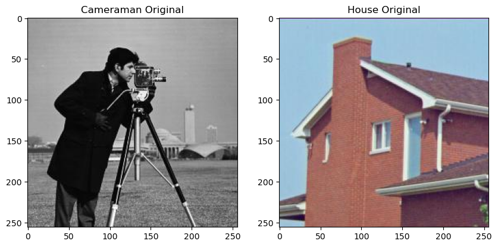
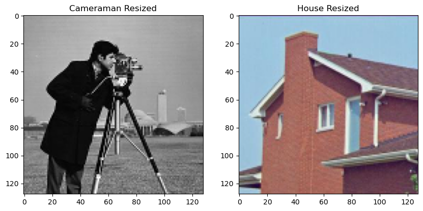

# Interpolation Methods 

## 1. Nearest Neighborhood Interpolation

**Overview:**
Nearest Neighborhood Interpolation is a straightforward method frequently employed in image processing for resizing or transforming images. In this method, the value of the nearest pixel to the interpolated point is assigned. Essentially, it utilizes the color or intensity value of the closest existing pixel in the original image to represent the value of the new pixel. While computationally efficient, this method often results in blocky or pixelated outcomes, especially when upscaling an image.

## 2. Bilinear Interpolation

**Overview:**
Bilinear Interpolation is a more advanced interpolation technique that takes into account the values of the four nearest pixels surrounding the interpolated point. It computes a weighted average of these pixel values based on the distance of the point from each pixel. Compared to Nearest Neighborhood Interpolation, Bilinear Interpolation yields a smoother transition between pixels. This method is commonly utilized in image scaling and rotation processes, providing superior visual quality, especially for moderate changes in image size.

## 3. Bicubic Interpolation

**Overview:**
Bicubic Interpolation is an extension of Bilinear Interpolation that involves considering a larger neighborhood of 16 surrounding pixels. Instead of linear interpolation, it employs a cubic polynomial to calculate the weighted average of pixel values. Bicubic Interpolation delivers even smoother and more accurate results, making it suitable for applications requiring high-quality image interpolation, such as medical imaging or graphic design. Although more computationally intensive than Nearest Neighborhood and Bilinear Interpolation, the enhanced visual quality often justifies its use in specific scenarios.

## Summary

These interpolation methods offer varying levels of visual quality and computational complexity. The selection of an interpolation method depends on the specific requirements of the image processing task:

- **Nearest Neighborhood Interpolation:** Simplest, computationally efficient, but may produce blocky or pixelated results, especially when upscaling.

- **Bilinear Interpolation:** Provides better visual quality than Nearest Neighborhood, particularly for moderate changes in image size.

- **Bicubic Interpolation:** Offers higher precision and smoothness, suitable for applications demanding superior image quality, despite being more computationally intensive.

## Examples

Attached are three example images demonstrating the results of Nearest Neighborhood, Bilinear, and Bicubic interpolations.

- `Original.png`
- `Nearest_Neighborhood_0.5.jpg`
- `Bilinear_0.5.png`
- `Bicubic_0.5.png`

Feel free to explore and compare the visual differences among these interpolation methods in the provided examples.

